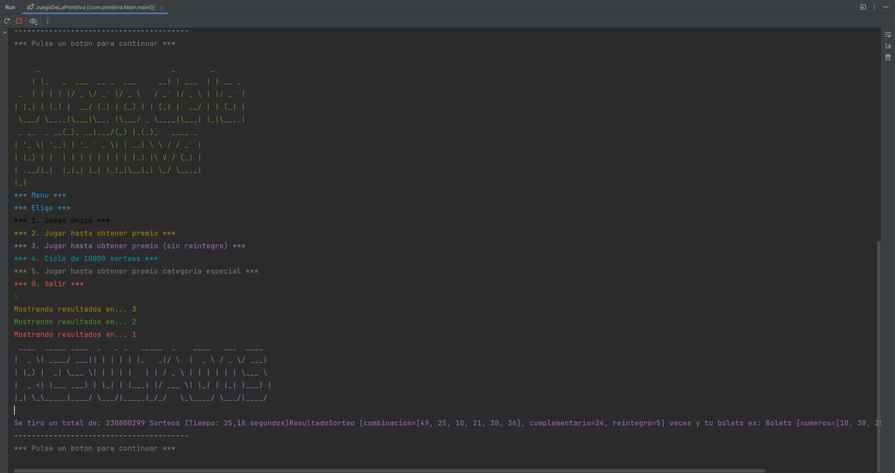

<p align="center">
    
</p>
<p align="center"><h1 align="center">JUEGO DE LA PRIMITIVA</h1></p>
<p align="center">
	<em>Test Your Luck with Primitiva Magic!</em>
</p>

<p align="center"><!-- default option, no dependency badges. -->
</p>
<p align="center">
	<!-- default option, no dependency badges. -->
</p>
<br>

##  Table of Contents

- [ Overview](#-overview)
- [ Project Structure](#-project-structure)
  - [ Project Index](#-project-index)
- [ Getting Started](#-getting-started)
  - [ Prerequisites](#-prerequisites)
  - [ Installation](#-installation)
  - [ Usage](#-usage)
 
---

##  Overview

JuegoDeLaPrimitiva is a user-friendly open-source project that simplifies playing the Spanish lottery game, La Primitiva. It allows users to create and manage lottery tickets effortlessly, either by choosing numbers manually or generating them automatically. With features like automated ticket creation and result tracking, this project caters to lottery enthusiasts seeking a seamless gaming experience.

---


##  Project Structure

```sh
JuegoDeLaPrimitiva/
│
├── src/main/java/com/primitiva/
│   │
│   ├── Main.java
│   ├── PrimitivaConstantes.java
│   │
│   ├── gestion/
│   │   ├── Bombo.java
│   │   ├── ResultadoSorteo.java
│   │   └── Sorteo.java
│   │
│   └── juego/
│       ├── Boleto.java
│       ├── Juego.java
│       ├── JuegoPrimitiva.java
│       └── Premios.java
│
├── build.gradle
└── README.md
    
   


```


###  Project Index
<details open>
	<summary><b><code>JUEGODELAPRIMITIVA/</code></b></summary>
	<details> <!-- __root__ Submodule -->
		<summary><b>__root__</b></summary>
		<blockquote>
			<table>
			<tr>
				<td><b><a href='https://github.com/JavMB/JuegoDeLaPrimitiva/blob/master/gradlew.bat'>gradlew.bat</a></b></td>
				<td>- Facilitates Gradle execution on Windows by setting up JVM options and locating the Java executable<br>- Resolves the Gradle application's classpath and invokes the GradleWrapperMain class to run Gradle tasks<br>- Handles JAVA_HOME validation and provides error messages for invalid configurations.</td>
			</tr>
			<tr>
				<td><b><a href='https://github.com/JavMB/JuegoDeLaPrimitiva/blob/master/build.gradle'>build.gradle</a></b></td>
				<td>- Configure Checkstyle plugin for Java code quality checks in the project build.gradle file<br>- Set up Checkstyle tool version and configuration file path<br>- Ensure Checkstyle reports are generated in both XML and HTML formats.</td>
			</tr>
			<tr>
				<td><b><a href='https://github.com/JavMB/JuegoDeLaPrimitiva/blob/master/settings.gradle'>settings.gradle</a></b></td>
				<td>Defines the project name 'JuegoDeLaPrimitiva' in the settings.gradle file within the project structure.</td>
			</tr>
			</table>
		</blockquote>
	</details>
	<details> <!-- .github Submodule -->
		<summary><b>.github</b></summary>
		<blockquote>
			<details>
				<summary><b>workflows</b></summary>
				<blockquote>
					<table>
					<tr>
						<td><b><a href='https://github.com/JavMB/JuegoDeLaPrimitiva/blob/master/.github/workflows/gradle.yml'>gradle.yml</a></b></td>
						<td>- Automates Java CI/CD pipeline with Gradle, ensuring code quality and build success on push and pull requests to main and develop branches<br>- Sets up JDK 17, compiles code, and grants necessary permissions for seamless integration.</td>
					</tr>
					</table>
				</blockquote>
			</details>
		</blockquote>
	</details>
	<details> <!-- src Submodule -->
		<summary><b>src</b></summary>
		<blockquote>
			<details>
				<summary><b>main</b></summary>
				<blockquote>
					<details>
						<summary><b>java</b></summary>
						<blockquote>
							<details>
								<summary><b>com</b></summary>
								<blockquote>
									<details>
										<summary><b>primitiva</b></summary>
										<blockquote>
											<table>
											<tr>
												<td><b><a href='https://github.com/JavMB/JuegoDeLaPrimitiva/blob/master/src/main/java/com/primitiva/Main.java'>Main.java</a></b></td>
												<td>- The Main.java file in the project's codebase is responsible for creating and managing lottery tickets for the Primitiva game<br>- It allows users to input numbers manually or generate them automatically<br>- The file orchestrates the creation of tickets and presents a menu for user interaction within the Primitiva game system.</td>
											</tr>
											<tr>
												<td><b><a href='https://github.com/JavMB/JuegoDeLaPrimitiva/blob/master/src/main/java/com/primitiva/PrimitivaConstantes.java'>PrimitivaConstantes.java</a></b></td>
												<td>- Defines constants and utility methods for a Spanish lottery game<br>- Manages input, randomization, and messages<br>- Includes color and presentation settings<br>- Displays game name, ticket creation, and results.</td>
											</tr>
											</table>
											<details>
												<summary><b>GestionSorteo</b></summary>
												<blockquote>
													<table>
													<tr>
														<td><b><a href='https://github.com/JavMB/JuegoDeLaPrimitiva/blob/master/src/main/java/com/primitiva/GestionSorteo/Bombo.java'>Bombo.java</a></b></td>
														<td>- The Bombo class manages a pool of random numbers, allowing extraction without repetition<br>- It facilitates generating and extracting random numbers within a specified range, ensuring no duplicates<br>- The class encapsulates the logic for maintaining and manipulating the pool of numbers efficiently.</td>
													</tr>
													<tr>
														<td><b><a href='https://github.com/JavMB/JuegoDeLaPrimitiva/blob/master/src/main/java/com/primitiva/GestionSorteo/ResultadoSorteo.java'>ResultadoSorteo.java</a></b></td>
														<td>- Defines a class representing lottery draw results with the main attributes: combination, complementary number, and refund number, along with the draw date and time<br>- The class ensures the combination has the correct number of elements and provides methods to access and display the result details.</td>
													</tr>
													<tr>
														<td><b><a href='https://github.com/JavMB/JuegoDeLaPrimitiva/blob/master/src/main/java/com/primitiva/GestionSorteo/Sorteo.java'>Sorteo.java</a></b></td>
														<td>- Generates lottery results efficiently by selecting main numbers, a complementary number, and a refund number<br>- Provides access to the current results and winning outcome.</td>
													</tr>
													</table>
												</blockquote>
											</details>
											<details>
												<summary><b>Juego</b></summary>
												<blockquote>
													<table>
													<tr>
														<td><b><a href='https://github.com/JavMB/JuegoDeLaPrimitiva/blob/master/src/main/java/com/primitiva/Juego/JuegoPrimitiva.java'>JuegoPrimitiva.java</a></b></td>
														<td>- Implements a Primitiva lottery game with functionalities to play single draws, determine prizes, and run multiple draws<br>- Includes options to play until a specific prize is won and track the time taken to achieve it<br>- Additionally, provides the ability to retrieve the results of the latest draw.</td>
													</tr>
													<tr>
														<td><b><a href='https://github.com/JavMB/JuegoDeLaPrimitiva/blob/master/src/main/java/com/primitiva/Juego/Premios.java'>Premios.java</a></b></td>
														<td>- Define prize categories for a lottery game<br>- The enum class 'Premios' encapsulates different prize levels with corresponding text descriptions<br>- It provides a structured way to represent and manage prize categories within the game architecture.</td>
													</tr>
													<tr>
														<td><b><a href='https://github.com/JavMB/JuegoDeLaPrimitiva/blob/master/src/main/java/com/primitiva/Juego/Boleto.java'>Boleto.java</a></b></td>
														<td>- The Boleto class generates lottery tickets with unique numbers and a randomly assigned bonus number<br>- It ensures ticket validity by checking for duplicates and out-of-range numbers<br>- The class offers methods to retrieve the ticket numbers and bonus number, as well as a string representation of the ticket.</td>
													</tr>
													</table>
												</blockquote>
											</details>
										</blockquote>
									</details>
								</blockquote>
							</details>
						</blockquote>
					</details>
				</blockquote>
			</details>
		</blockquote>
	</details>
</details>

---
##  Getting Started

###  Prerequisites

Before getting started with JuegoDeLaPrimitiva, ensure your runtime environment meets the following requirements:

- **Programming Language:** Java
- **Package Manager:** Gradle


###  Installation

Install JuegoDeLaPrimitiva using one of the following methods:

**Build from source:**

1. Clone the JuegoDeLaPrimitiva repository:
```sh
❯ git clone https://github.com/JavMB/JuegoDeLaPrimitiva
```

2. Navigate to the project directory:
```sh
❯ cd JuegoDeLaPrimitiva
```

3. Install the project dependencies:


**Using `gradle`** &nbsp; [](https://gradle.org/)

```sh
❯ gradle build
```


###  Usage
Run JuegoDeLaPrimitiva using the following command:
**Using `gradle`** &nbsp; [](https://gradle.org/)

```sh
❯ gradle run
```


